# Top 12 Best Global Ecommerce Fulfillment Ranked in 2025 (Latest Compilation)

Running a successful online store means getting products to customers fast, without headaches or delays. When orders pile up and shipping becomes a bottleneck, that's when smart brands turn to professional fulfillment providers. These logistics partners handle everything from warehousing to last-mile delivery, so you can focus on what matters: growing your business and keeping customers happy.

## **[ShipBob](https://shipbob.com)**

Your fastest path to nationwide two-day delivery with distributed warehousing that actually scales.

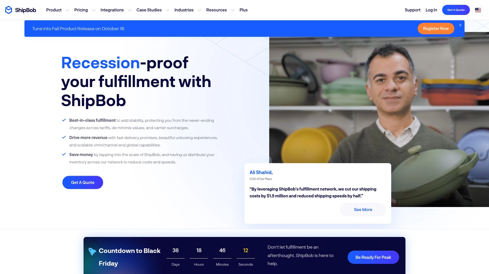

ShipBob operates over 60 fulfillment centers globally, giving you strategic placement across the US and beyond. This distributed network means you store inventory closer to customers and ship orders faster—often within two days via ground shipping to most of the continental United States.

Their platform integrates directly with major ecommerce channels like Shopify, WooCommerce, Amazon, and BigCommerce. Orders flow automatically from your store to their warehouses where teams pick, pack, and ship with documented accuracy rates above 99.97%. Real-time inventory tracking across all locations keeps you informed without constant check-ins.

ShipBob handles the heavy lifting: receiving inventory, quality checks, storage optimization, custom packaging for brand consistency, and returns processing. You get access to negotiated carrier rates that typically beat what individual sellers can secure on their own. Their 2-day shipping program covers the vast majority of US addresses using ground service.

For growing brands dealing with seasonal spikes or expanding into new markets, ShipBob's inventory distribution tools automatically suggest optimal warehouse placement based on where your customers live. This reduces shipping zones, cuts costs, and improves delivery speed without you manually calculating distances.

The dashboard provides visibility into order status, inventory levels, and performance metrics. When something needs attention, their support team responds quickly. International shipping extends your reach to 250+ destinations with standard and expedited options, plus DDP services to simplify customs.

Whether you're fulfilling 100 orders monthly or scaling into the thousands, ShipBob's infrastructure adapts without requiring you to renegotiate contracts or move operations. Same-day fulfillment cutoffs mean orders placed early ship the same business day, keeping your delivery promises intact.

***

## **[Flexport](https://www.flexport.com/products/ecommerce-fulfillment/)**

End-to-end logistics combining freight forwarding with ecommerce fulfillment across 60+ global warehouses.

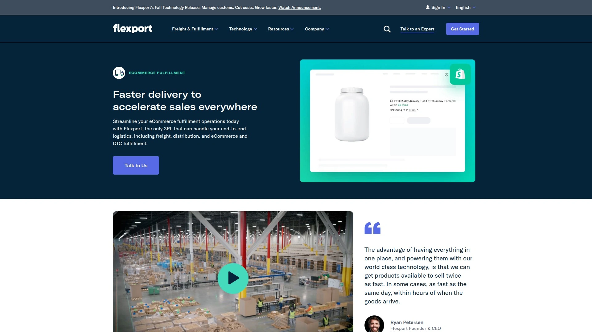

Flexport brings together international freight management and domestic fulfillment under one platform. If you're sourcing products overseas and selling in multiple countries, this integrated approach eliminates handoffs between different logistics providers. Shipments move from factory to customer with unified tracking and visibility.

Their fulfillment network includes strategically located centers that enable fast delivery across major markets. The platform connects directly with Shopify through the Shopify Fulfillment Network app, plus integrations with Amazon, Walmart Marketplace, and 50+ other channels. AI-driven inventory placement analyzes your sales patterns to suggest where products should be stored for optimal speed and cost.

**Services:** Warehousing, B2C and B2B fulfillment, freight coordination, customs brokerage, international shipping with DDP/DDU options, returns management, value-added services like labeling and kitting. Their technology handles complex routing decisions automatically.

**Best for:** Mid-size to enterprise brands managing international supply chains who want one partner handling both inbound freight and final-mile delivery. Particularly valuable if you're expanding into new geographic markets or managing high SKU counts across multiple sales channels.

Note that Flexport introduced a $5,000 monthly minimum for fulfillment services starting 2026, positioning them toward higher-volume sellers. For brands meeting that threshold, the comprehensive service suite and global reach provide significant operational advantages.

***

## **[Red Stag Fulfillment](https://redstagfulfillment.com/order-fulfillment/)**

Specialized handling for oversized, heavy, and high-value items with industry-leading accuracy guarantees.

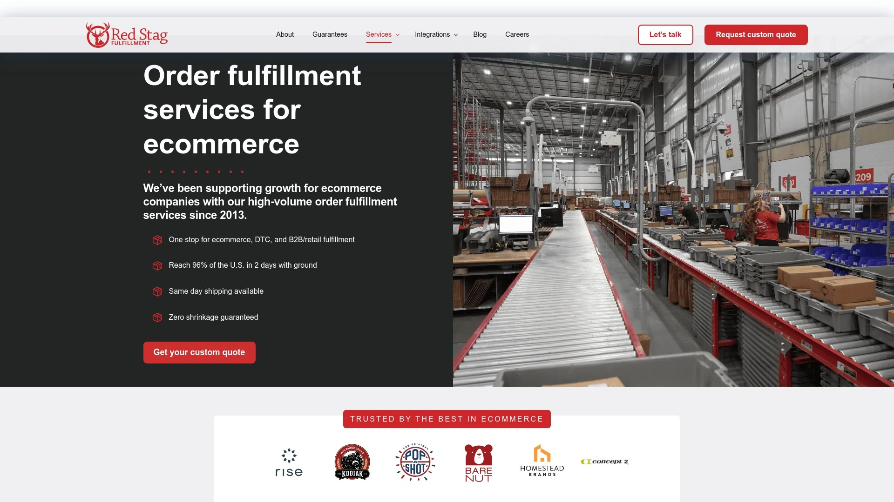

Most 3PLs optimize for small parcels. Red Stag built their entire operation around products that weigh over 20 pounds or require extra care. Think furniture, large appliances, fitness equipment, or anything bulky that standard fulfillment centers struggle with.

Their facilities feature high ceilings, wide aisles, and equipment designed for heavy items. Teams trained specifically in handling these products reduce damage rates significantly. They back this up with aggressive guarantees: $50 paid to you for any mis-shipped order, $100 plus wholesale cost for any lost or damaged inventory, and 100% on-time fulfillment or they cover the costs.

Integration with major platforms works seamlessly, and they offer custom API builds if your stack is unique. The error rate sits at 0.02%—one mistake per 5,000 orders. Same-day fulfillment cutoff extends to 5 PM local time, much later than industry standard.

Red Stag operates fulfillment centers in Memphis, Tennessee, and Salt Lake City, with expansion planned for Pennsylvania and California. This setup achieves two-day ground shipping to 96% of US addresses. They work with five major carriers to optimize routing and pricing.

The service includes inbound receiving with 48-hour guarantees, real-time inventory visibility, custom packaging options, and returns processing. Every facility uses barcode scanning at every touchpoint, and integrated video monitoring helps diagnose any issues that do occur.

There's a $500 monthly minimum, and pricing runs higher than budget 3PLs—expect 10-20% more than general providers. That premium buys specialized infrastructure and financial guarantees that protect your investment. If you're shipping bulky or valuable goods, the extra cost typically pays for itself through reduced damage claims and customer complaints.

***

## **[Shipfusion](https://www.shipfusion.com)**

FDA-certified fulfillment for food, beverages, supplements, and temperature-sensitive products.

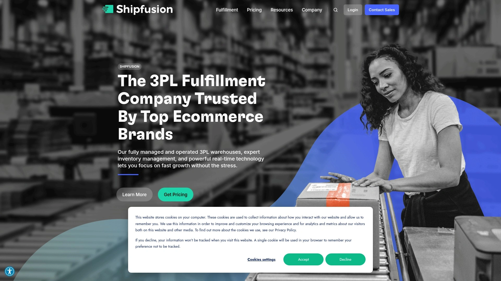

When your products need climate control or regulatory compliance, most 3PLs can't help. Shipfusion built their network specifically for items that require careful handling: food, beauty products, nutraceuticals, and anything sensitive to temperature or humidity.

Their facilities hold FDA, SQF, and Health Canada certifications. Climate-controlled zones maintain stable environments year-round. Lot tracking and FIFO/FEFO systems ensure proper rotation. If you're shipping probiotics, chocolates, or anything that degrades without proper storage, this infrastructure matters.

The 360 Warehouse Management System provides real-time inventory visibility with batch and lot tracking built in. Orders integrate automatically from Shopify, WooCommerce, Amazon, and other platforms. Cold chain shipping logic checks weather forecasts at destination addresses and adds appropriate packaging when needed.

**Core capabilities:** Temperature-controlled warehousing, lot tracking, expiry management, DTC and B2B fulfillment, international shipping, returns management with inspection protocols, custom packaging, and kitting services. Facilities located strategically in North America for broad coverage.

This level of specialization costs more than generic warehousing, but it's necessary for compliance and product quality. Shipfusion serves brands where product integrity directly impacts customer safety and satisfaction. Their teams understand the regulations specific to food and supplement industries, reducing compliance risks.

Integration takes 2-3 weeks typically. The dashboard gives visibility into inventory status, order processing, and upcoming expirations. Account managers who understand the unique challenges of food and supplement brands provide ongoing support.

***

## **[ShipMonk](https://www.shipmonk.com/lp/3pl-services)**

Technology-driven fulfillment across 12 owned facilities with robust automation and real-time analytics, built for high-volume ecommerce brands needing precision at scale.

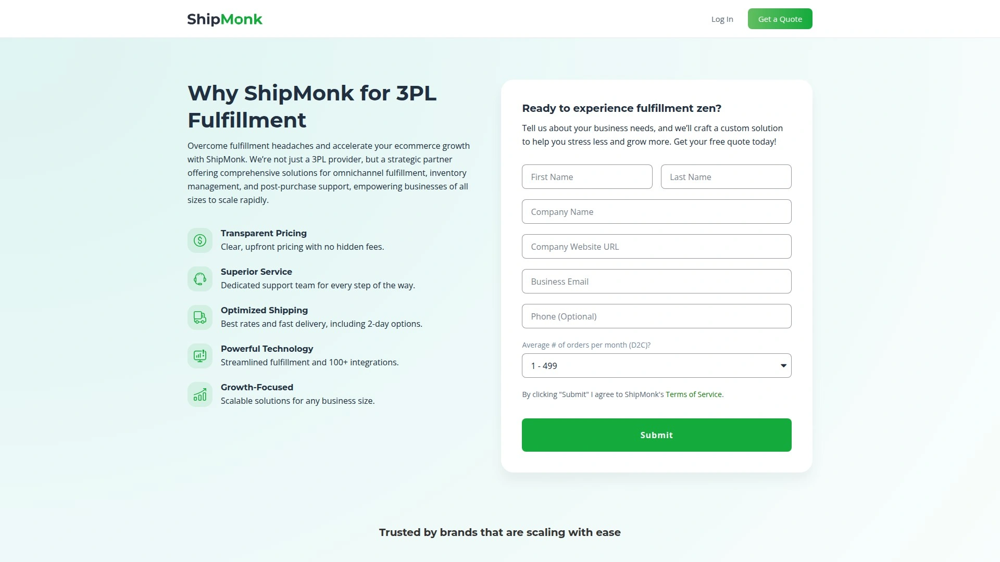

ShipMonk operates fulfillment centers across the US, Mexico, Canada, UK, and Europe—all owned and operated internally for consistent service. Their proprietary software suite includes a warehouse management system, inventory management system, and order management system that work together seamlessly.

**What they do well:** Processing high order volumes with advanced automation including mobile robots, pick-to-light systems, and automated sorting. These technologies reduce pick times and increase accuracy. Same-day order processing handles orders received by cutoff time. The Virtual Carrier Network uses deep carrier relationships to secure competitive shipping rates.

The platform auto-merges multiple orders for the same customer to reduce fulfillment costs. Backorder management, branded tracking pages, serialization, and lot control come standard. Custom packaging options help create memorable unboxing experiences. Integration works with 100+ shopping carts and marketplaces including all major platforms.

ShipMonk's dimensional SKU scanning captures detailed product data on intake—weight, dimensions, photos—used to optimize box selection and calculate accurate shipping costs. Smart storage auto-slotting places inventory based on velocity, improving pick efficiency. Returns and reverse logistics are handled through the same platform.

The service targets scaling brands with complex needs like subscription boxes, multi-channel selling, or seasonal volume fluctuations. Transparency in pricing and comprehensive analytics help you understand exactly where fulfillment dollars go. No order minimums make it accessible for growing businesses, though the full value shows at higher volumes where automation delivers significant time savings.

***

## **[eFulfillment Service](https://www.efulfillmentservice.com)**

Over 20 years serving small to medium sellers with transparent pricing, no minimums, and genuinely responsive support.

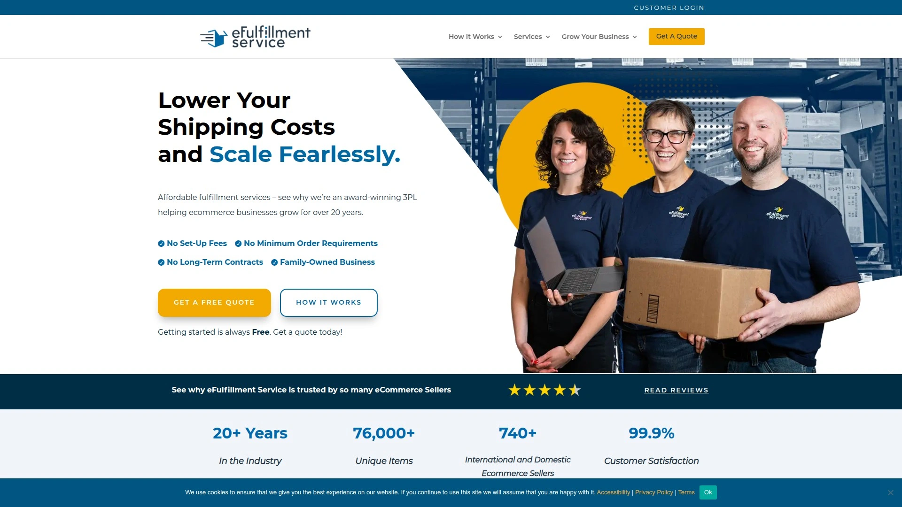

eFulfillment Service built their reputation on being the opposite of big, complicated 3PLs. No setup fees. No integration costs. No long-term contracts. No order minimums. Just straightforward fulfillment for businesses that need reliability without red tape.

They operate fulfillment centers in Michigan with additional locations for expanded coverage. The facility handles inventory receiving, storage, pick and pack services, and shipping across all major carriers. Order accuracy runs at 99.9%. Customer satisfaction surveys consistently show ratings above 99.7%.

Integration connects to 40+ shopping carts and marketplaces through their proprietary software. The dashboard lets you monitor orders 24/7, view inventory levels, forecast needs, manage returns, track shipments, and download invoices. Real-time alerts notify you of low stock before it becomes a problem.

Their team actually answers phones and responds to emails—usually within hours, not days. Account managers know your business and provide honest guidance about what will and won't work. This personal touch stands out in an industry where support often feels like talking to scripts.

Services include kitting and assembly, custom packaging with inserts or branded materials, returns processing, and special project handling. They're flexible enough to accommodate unique requirements without charging enterprise-level fees.

Pricing stays competitive with volume-based discounts that kick in naturally as you grow. The transparent fee structure means no surprise charges at month-end. Perfect for startups and growing brands that value clear communication and don't want to feel like just another account number in a massive 3PL network.

***

## **[Amazon FBA](https://sell.amazon.com/fulfillment-by-amazon)**

Leverage Amazon's massive infrastructure for Prime eligibility and instant credibility with millions of shoppers.

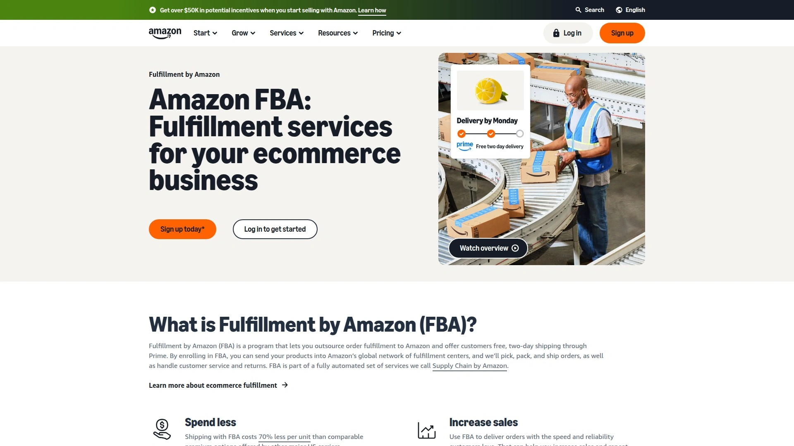

FBA plugs you directly into Amazon's distribution network—the largest and fastest in ecommerce. Send inventory to their fulfillment centers, and they handle storage, picking, packing, shipping, customer service, and returns. Your products become eligible for Prime two-day shipping, dramatically improving conversion rates.

The infrastructure is unmatched. Hundreds of fulfillment centers worldwide positioned for next-day or same-day delivery in many markets. Shipping costs with FBA run 70% less than comparable premium options from other carriers for similar service levels.

Setup works through Seller Central. Create listings, designate products for FBA, prep according to Amazon's requirements, create shipping plans, and send inventory. Once received, items are available for immediate purchase. Multi-Channel Fulfillment lets you use FBA to ship orders from your own website or other sales channels, though at different rates.

**Key benefits:** Instant Prime badge credibility, access to Amazon's customer base, automated customer service, professional returns handling, global reach, and no need to negotiate carrier rates. The FBA New Selection program offers free storage and customer returns for new products.

The tradeoffs: Less control over branding and customer experience. Higher fees compared to some 3PLs, especially for slow-moving inventory or larger items. Storage fees during peak season can surprise sellers. Strict compliance requirements mean mistakes get expensive fast.

Amazon Warehousing and Distribution (AWD) provides upstream bulk storage at lower rates, automatically replenishing FBA as needed. This two-tier approach optimizes costs for brands with deep inventory.

FBA works brilliantly for products that fit Amazon's sweet spot—medium velocity items in standard sizes. If your primary sales channel is Amazon or you want instant access to Prime customers, it's hard to beat. For brands prioritizing customer relationships and control over the post-purchase experience, traditional 3PLs offer more flexibility.

***

## **[Stord](https://www.stord.com/fulfillment)**

Omnichannel fulfillment combining owned facilities with a network of 1,000+ partner warehouses for ultimate flexibility.

Stord takes a different approach. Rather than only operating their own warehouses, they combine owned facilities with a massive partner network. This hybrid model lets them offer customized solutions that traditional 3PLs can't match—whether you need dedicated space, shared warehousing, or strategic distribution across multiple locations.

Their technology platform provides a single control tower view across all fulfillment locations. You get consistent service level agreements whether orders ship from a Stord facility or a partner warehouse: 99% on-time shipping, 99.9% order accuracy, 99.5% inventory accuracy.

**Services:** B2C fulfillment, B2B fulfillment and retail distribution, dedicated warehousing, kitting, custom packaging, parcel and freight shipping with volume discounts, temperature-controlled storage, cross-docking, forward stocking, and pallet-in/pallet-out operations. The platform integrates with ERPs, sales channels, and warehouse management systems.

The retail consolidation program combines shipments from multiple brands going to the same big-box retailer (Walmart, Target, Costco), reducing transportation costs by up to 30% compared to LTL shipping. This makes retail distribution accessible for growing brands that don't have full truckloads.

Stord's accelerator initiative brings enterprise-level capabilities to emerging brands—discounted parcel rates through Stord Parcel, same-day shipping, shipment protection, and access to their order management system with real-time inventory availability and exception management.

The flexibility comes at enterprise pricing. Brands shipping thousands of orders monthly with complex needs (retail plus DTC, temperature-controlled products, or strategic multi-location distribution) benefit most. The unified technology and diverse warehouse options solve problems that usually require multiple logistics partners.

***

## **[Fulfillrite](https://www.fulfillrite.com)**

Family-owned 3PL in New Jersey offering personalized service with 99.8% on-time shipping for ecommerce and crowdfunding campaigns.

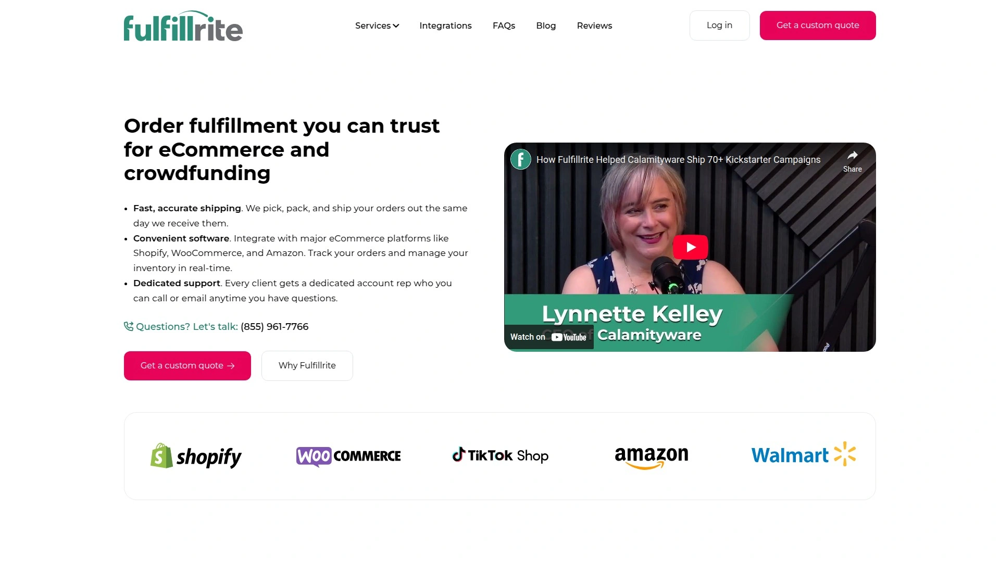

Fulfillrite operates from Lakewood, New Jersey, with a focus on ecommerce brands and crowdfunding campaigns—Kickstarter, Indiegogo, Gamefound, and similar platforms. They understand that backing fulfillment is different from standard ecommerce, with complex kitting requirements and demanding timelines.

The facility is climate-controlled for temperature-sensitive goods like supplements, probiotics, beauty products, and chocolates. Lot-level tracking supports FIFO and FEFO inventory management. Real-time software integration with major platforms means orders flow automatically.

Their service includes warehousing, pick and pack, custom packaging, international shipping with customs support, returns management with real-time tracking, kitting and assembly, subscription box fulfillment, Amazon FBA prep, and custom projects for unique needs.

What makes Fulfillrite different is the personal attention. Every client gets a dedicated account manager who knows your products and business. When issues arise, you talk to someone who actually understands context. Response times measure in hours, not days.

The New Jersey location provides affordable shipping rates with quick access to major East Coast markets and efficient routes to the rest of the country. International shipping reaches most destinations with competitive rates.

Pricing stays competitive with volume-based discounts. No minimum order requirements make it accessible for smaller brands. As you scale, the service scales with you without forcing you into enterprise-tier commitments before you're ready.

Perfect for brands that value being treated like a partner rather than an account number. If you're launching a crowdfunding campaign, growing a subscription business, or simply want a 3PL that actually cares about your success, Fulfillrite delivers on that promise.

***

## **[ShipHero](https://shiphero.com)**

Advanced WMS platform with 3PL services designed for brands needing enterprise-grade warehouse technology and high-volume processing power.

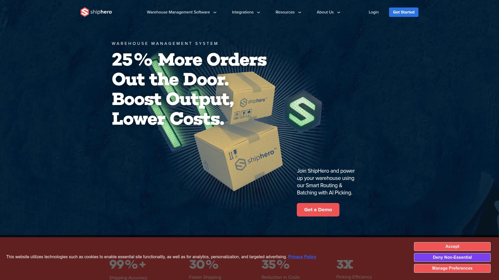

ShipHero started as warehouse management software and evolved into providing fulfillment services powered by their proprietary technology. This tech-first approach shows in every aspect—mobile picking, AI-driven path optimization, pack-to-light systems, and real-time carrier rate shopping.

The platform handles inventory management across multiple warehouses with support for barcoding, lot tracking, serialization, kitting, and product rotation. Order management centralizes processing from all sales channels with automatic imports, order splitting, bundling, and backorder management. Smart automation generates shipping labels, selects optimal carriers, and prints in batches.

Their AI picking technology reduces walking time by 20-30% through optimized warehouse routing and smart order batching. Pickers follow LED lights to exact item locations, increasing speed and accuracy. Automated conveyors and sorting systems move packages efficiently through facilities.

ShipHero fulfills through LVK Logistics, their 3PL subsidiary offering direct-to-consumer fulfillment in Las Vegas with personalized service and white-glove handling. The location provides excellent coverage for Western US customers with fast ground shipping.

**Integration ecosystem:** Connects with Shopify, Amazon, eBay, Walmart, WooCommerce, BigCommerce, and virtually every major platform. Carrier integrations include UPS, FedEx, DHL, USPS, and regional carriers. Advanced analytics and customizable reporting provide deep operational insights.

The service works for brands processing significant order volumes where warehouse efficiency directly impacts profitability. Sophisticated inventory needs like lot tracking, expiration management, or complex kitting benefit from the advanced WMS capabilities. Returns management includes automated processes, branded portals, and restocking workflows.

ShipHero suits mid-sized to enterprise brands that need robust technology, detailed analytics, and high-volume processing capabilities. The combination of powerful software with professional fulfillment services creates efficiency gains that offset higher pricing compared to basic 3PLs.

---

## **[Cahoot](https://www.cahoot.ai)**

Peer-to-peer fulfillment network delivering nationwide 1-2 day shipping at 30% lower cost through distributed merchant warehouses and patented routing technology.

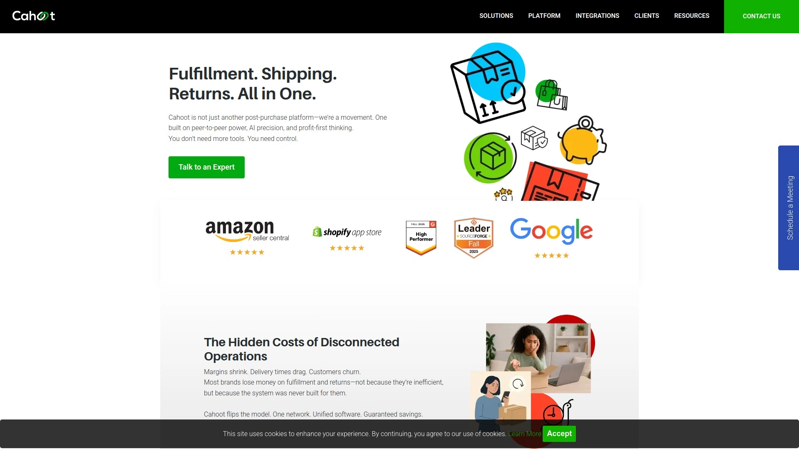

Cahoot operates differently than traditional 3PLs. Their network consists of 100+ fulfillment centers—many operated by other ecommerce merchants who share warehouse space. This peer-to-peer model distributes inventory close to customers nationwide without requiring you to negotiate with multiple providers.

The platform's patented software automatically routes orders to the nearest fulfillment location, achieving 1-day and 2-day delivery to over 90% of the US population using ground shipping rates. Costs run approximately 30% lower than traditional 3PL networks because the model eliminates many overhead expenses.

**Core features:** Same-day order fulfillment six days per week (cutoff at 2pm), weekend fulfillment, 99.9% order accuracy, 99.95% on-time shipping, real-time fulfillment and shipping visibility, integration with all major sales channels, and Seller Fulfilled Prime eligibility on Amazon.

The system provides complete transparency from order click to delivery. Fast receiving—typically within 2 business days—keeps your supply chain moving. Onboarding takes 2 weeks or less. The software is intuitive enough that warehouse and operations teams learn it quickly.

Cahoot works for brands prioritizing speed and cost savings over having dedicated warehouse space. The distributed model means your inventory lives in multiple locations optimized for customer proximity. If you're comfortable with inventory being managed across a network rather than in facilities you visit personally, the economics are compelling.

The peer-to-peer approach also includes returns management that routes items to the next customer rather than back to a central warehouse, recovering more value from returned products. This reduces costs while improving sustainability.

Best suited for growing ecommerce brands shipping hundreds to thousands of orders monthly who want Prime-like delivery speeds without FBA fees or restrictions. The technology handles complexity while you focus on sales and customer acquisition.

***

## **[MyFBAPrep](https://myfbaprep.com)**

International network of 50+ prep and fulfillment warehouses specializing in Amazon FBA, FBM, and Seller Fulfilled Prime with fast turnaround and nationwide coverage.

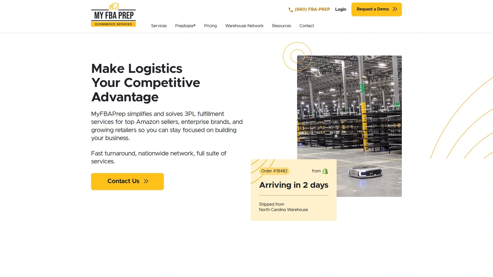

MyFBAPrep connects you to an extensive network of vetted prep centers and fulfillment warehouses across North America and internationally. With over 1 million square feet of operating space, they provide immediate scalability and redundancy that single-location 3PLs can't match.

Their specialization is Amazon—FBA prep, Fulfilled by Merchant, Seller Fulfilled Prime, and returns processing. Teams understand Amazon's detailed requirements intimately, ensuring compliance without trial and error. SLAs guarantee prep completion in 24-72 hours, keeping your inventory moving into FBA without delays.

**Services include:** Meticulous Amazon prep (labeling, bundling, multipacks, kitting, FNSKU application, shrink wrapping, polybagging), DTC fulfillment for your own website, retail replenishment for brick-and-mortar stores, subscription box fulfillment, temperature-controlled logistics for refrigerated and frozen products, specialized machinery for scale operations, rework and inspection, and comprehensive value-added services.

The proprietary Preptopia tracking system provides real-time visibility into inventory status, order progress, and item-level tracking. You can monitor everything from initial receipt through final shipment. Direct access to account managers means questions get answered by people who know your account.

MyFBAPrep's nationwide distribution network enables 1-2 day delivery to customers anywhere in the US when used for DTC fulfillment. The redundancy of 50+ locations protects against disruptions—if one facility hits capacity or faces issues, your operations shift seamlessly to another location.

Pricing includes transparency and no long-term contracts. Volume discounts kick in naturally as you scale. White-glove customer service means you're working with logistics professionals who act as consultants, not just order takers.

Perfect for Amazon sellers who want expert prep services, fast turnaround times, and nationwide fulfillment capabilities. Also ideal for brands operating both on Amazon and through their own channels who want one partner handling all fulfillment needs.

---

## **[Buske Logistics](https://www.buske.com/our-solutions/fulfillment-warehousing)**

Century-old 3PL trusted by Fortune 500 companies offering comprehensive fulfillment, warehousing, and specialized services including temperature-controlled storage.

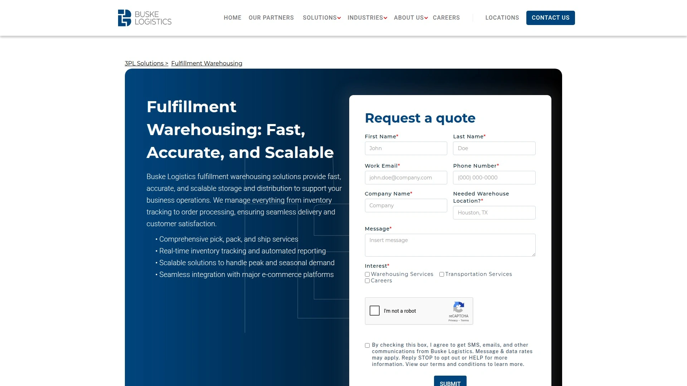

Buske Logistics brings over 100 years of supply chain expertise to ecommerce fulfillment. Operating 37+ facilities across North America, they serve enterprise clients and mid-market businesses with reliable, scalable solutions.

Their facilities in Nevada (Las Vegas, Henderson, and regional coverage) provide strategic positioning for West Coast and Southwest distribution. Locations handle retail fulfillment, ecommerce orders, and B2B distribution with equal proficiency.

Services encompass comprehensive pick, pack, and ship operations, real-time inventory tracking with automated reporting, scalable solutions for handling peak seasons and demand fluctuations, seamless integration with major ecommerce platforms, temperature-controlled warehousing for food and beverage industries, and regulatory compliance for specialized products.

Buske serves industries with complex requirements: retail, food and beverage, manufacturing, and consumer goods. Their experience navigating industry-specific regulations reduces risk for brands where compliance is critical.

The technology platform provides visibility across all inventory locations, order statuses, and performance metrics. Integration with your existing systems—ecommerce platforms, ERPs, or custom software—happens smoothly through their technical team.

What a century in business teaches: consistency, reliability, and the ability to adapt. Buske survived and thrived through massive logistics industry changes by focusing on operational excellence and client relationships. Fortune 500 companies don't stick with 3PL partners for decades without good reason.

Pricing sits at enterprise level, appropriate for brands shipping substantial volumes or needing specialized services like temperature control, hazmat handling, or retail-specific requirements. The investment buys professional operations, proven processes, and the confidence that comes from working with established logistics experts.

***

## Common Questions

**How do I choose between FBA and a traditional 3PL?**
FBA works best when Amazon is your primary channel and you want immediate Prime eligibility. Traditional 3PLs give you more control over branding, customer data, and multichannel fulfillment. If you sell on your own website or multiple marketplaces, a 3PL offers more flexibility. If Amazon dominates your sales, FBA's convenience is hard to beat.

**What's the typical cost difference between budget and premium fulfillment services?**
Expect budget 3PLs to charge $3-5 per order for pick and pack plus actual shipping costs. Premium providers with specialized handling or guarantees run $5-8 per order plus shipping. Storage ranges from $0.50 to $2 per cubic foot monthly depending on location and service level. Volume discounts kick in at different thresholds with each provider.

**How long does it take to switch from one 3PL to another?**
Plan for 4-6 weeks minimum. You'll need to set up integrations, transfer inventory, test order flows, and coordinate timing to avoid gaps in fulfillment. Working with an experienced 3PL that handles onboarding professionally reduces stress significantly. Some providers offer white-glove transition services that manage the entire process for you.

***

## Getting Started

Finding the right fulfillment partner transforms operations. When inventory, picking, packing, and shipping run smoothly in the background, you gain time to focus on product development, marketing, and customer relationships—the activities that actually grow your business.

[ShipBob](https://shipbob.com) stands out for brands needing reliable nationwide two-day delivery through distributed warehousing. Their technology, accuracy rates, and scalability make them particularly suitable for growing ecommerce companies ready to eliminate fulfillment as an operational bottleneck. The infrastructure handles volume increases seamlessly while maintaining service quality.

[70](https://8644069.fs1.hubspotusercontent-na1.net/hubfs/8644069/One_Pagers/Warehouse%20Overview%20OP%20(1).pdf)
